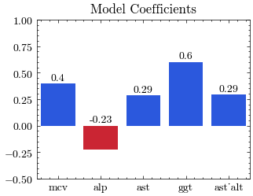

# Inferring Alcohol Consumption from Liver Disease Biomarkers

> Recognizing alcohol consumption as the primary cause of liver disease can help improve outcomes and longevity of otherwise healthy patients. Providing resources to patients in order to address heavy alcohol use in early stages of hepatotoxicity is key to reversing damage and preventing mortality. Because some patients may not truthfully volunteer their alcohol intake and because liver disease has many causes, a reliable test to distinguish moderate vs. heavy alcohol use is needed. The purpose of this project was to assess if heavy alcohol usage can be predicted from serum liver function tests and if so, which tests are most important in classifying alcohol intake. BUPA Liver Disorder dataset which contains 345 samples of liver function tests: MCV, ALP, AST, ALT, GGT and a count of daily half-pint drinks consumed was used to distinguish moderate and heavy drinkers. Using logistic regression without regularization, the model distinguished moderate vs. heavy drinkers the best when moderate drinking was defined as 2 drinks or fewer and resulted in 64% balanced accuracy score (55% sensitivity and 72% specificity). Increase in GGT was the best predictor of heavy alcohol, followed by increase in MCV, AST, and AST-ALT ratio. ALP was a negative predictor of alcohol use, all other things considered. While the methodology of this project can be used to develop an improved model, the actual results should not be utilized in clinical or personal settings since data collection has limitations preventing the model from generalizing to the wide population. 

## Motivation

Liver disease affects millions of people worldwide and is one of leading causes of premature death. According to CDC, 1.8% of adults older than 18 have liver disease and it is more prominent among populations living in poverty. ([source](https://ftp.cdc.gov/pub/Health_Statistics/NCHS/NHIS/SHS/2018_SHS_Table_A-4.pdf)). Although liver disease may be caused by genetic factors or viral infections, alcohol consumption is associated with the disease's most common manifestation ([source](https://pmc.ncbi.nlm.nih.gov/articles/PMC9599689/)). Alcohol-related cirrhosis affects a younger population more and has a lower life expectancy, comapred to other causes of the disease ([source](https://pubmed.ncbi.nlm.nih.gov/7648984/)). 

At the same time, not only is alcohol-related liver disease is preventable, in its eearly stages, the disease is also *reversable* [source](https://britishlivertrust.org.uk/information-and-support/liver-health-2/stages-of-liver-disease/). Thus reducing intake among healthy individuals and abstaining completely for individuals that suffer from liver disease can increase longevity among vulnerable populations and improve health outcomes. 

*Stages of liver disease. Image sourced from [British Liver Trust](https://britishlivertrust.org.uk/information-and-support/liver-health-2/stages-of-liver-disease/).*

Liver performs several key functions in a mammal body. This organ is responsible for filtration and storage of blood, metabolizing proteins into amino acids, and forming bile. Excess amino acids in the body are sent to the liver for processing and metabolism, where liver releases amonia (which will turn into uric acid), glutamate, glutamine, aspartate. 

While patients may choose to not disclose their alcohol consumption levels to the attending phisician, inferring consumption from liver disease biomarkers could provide insights to the medical staff and allow them to deliver necessary counceling and resources to the patient. Especially, detecing alcohol-induced liver damage has the potential to save lives. 

The goal of this project is to assess if measures of serum enzymes and size of red blood cells are good indicators of high alcohol consumption and can be utilized in clinical settings to provide guidance to physicians in diagnosing alcohol-induced liver disorders.

## Dataset

Liver Disorders dataset used in this study comes from the BUPA Medical Research Ltd and was obtained from UCI Machine Learning Repository [source](https://doi.org/10.24432/C54G67). BUPA provides medical coverage to patients worldwide.  The dataset was donated by Richard S. Forsyth and contains 5 features describing results of blood tests performed on male subjects in the 1980s. The dataset contains "drinks" columns which is used as a target variable in this analysis. `selector` column is included for the purpose of splitting training and testing subsets. Typically, this dataset is used in order to benchmark machine learning algorithms. 

The target variable counts the number of drinks that the study participant consumes daily and is measured in half-pints. The target variable can be modeled as Poisson random variable, since it counts discrete events happening within a fixed period of time. This metric is self-reported and may not be a truthful representation of the actual amount of alcohol consumed. Alcohol consumption may be variable for each individual and each participant might metabolize alcohol differently.

Nontheless, it would be interesting to know how much of the variance in alcohol consumption can be explained by the liver function test results.

Enzymes are released by the liver due to hepatocellular (specific to liver cells) injury include:
* AST (`sgot` in the dataset) - Aspartate Aminotransferase - an enzyme also found in muscles, found primarily in a mitochondrium of the liver lobule.
* ALT (`sgpt` in the dataset) - Alanine Aminotransferase - an enzyme primary to liver, found mostly in cytoplasm.

Generally, these two enzymes are found in 1-to-1 ratio. AST is more indicative of alcohol damage because ethanol found in alcohol may be causing damage to the mitochondria. Significantly large values of the ratio (ten times larger then the baseline) indicate an acute and severe disease due to alcohol damage. If the values are five times greater than the baseline, the values can indicate chronic conditions like fatty liver, chonic hepatatis, or prolonged use of liver-damaging medication instead. 

Enzymes which are associated to liver disease due to cholestasis (impairment of flow of bile from the liver to the small intestive) include:
* ALP (`alkphos`) - Alkaline Phosphotase - not specific to the liver and can be found in a number of organs.
* GGT (`gammagt`) - Gamma-Glutamil Transpeptidase - if this enzyme is up and ALP is up, it will point to cholestasis.

Albumin, PT, and Billirubin are frequently tested for liver disease and damage but are not included in this dataset. Instead, the dataset includes Mean Corpuscular Volume (MCV, `mcv`) which measures the average red blood cell size. Size of red blood cells could increase due to increased deposition of cholesterol and phospholipids on the membranes of the cells. A healthy liver is able to remove red blood cells during maturation (typically 120 days) but a damaged liver may not be as effective [source](https://www.youtube.com/watch?v=tY-1eOoDHSU). 

Liver damage can result from many factors. Viral hepatitis, genetic conditions, illicit drug use, and use of medication can cause liver damage as well. Age, demographics, diet, and environmental factors can alter bloodwork results. Longevity and pattern of alcohol consumption play a confounding role. Therefore, we should expect that the proportion of alcohol consumption variance explained by the model of liver function tests is fairly small.

A human body is not an islated system so it is likely that some of our feautres are not indepent of each other. However, it would still be helpful to assess their relationship with our target variable in order to assess their contribution to inferring alcohol consumption. 

## Methods

Findings from Exploratory Data Analysis (EDA):
* Drinks variable has a power-law-like or log-like distribution with most values concentrated closer to 0 and a longer tail but its variance is much higher than its mean.
* Drinks has integer values except one decimal at 0.5
* 5 predictors have mostly normal or log-normal distributions
* AST and ALT liver test results have 0.7 Pearson correlation which could negatively impact a generalized linear model of our choice
* There were several poinst of high leverage in the dataset

Due to high correlation between AST and ALT, AST-ALT ratio was added to features and ALT was removed. 

Dataset was split into a training and validation dataset with 80-20 ratio and standard scaler was implemented within the model pipeline. 

Given the task of predicting alcohol consumption from results of liver function tests and identifying which tests play an important role in the prediction, a generalized linear model was chosen for the task because it is able to produce interpretable feature coefficients and the model can be used easily in clinical settings. While Poisson and Gamma regressions assumptions would be violated, a linear regression or logistic regression were  evaluated. Linear Regression performed mediocre on the training dataset and did not generalize to the validation dataset at all. Therefore, a decision was made to proceed with Logistic Regression.

Since Logistic Regression works on classification tasks, it was necessary to convert drinks to a binary variable segmenting moderate drinkers and heavy drinkers using an upper threshold $k$ (s.t. $\text{drinks}>k$ indicates heavy consumption). 

Since threshold $k$ is not known, a model was fit to a variety of different thresholds, spanning possible values found in the dataset and $k$ was selected to optimize sensitivity and specificity. Values between 1 and 2.5 yielded a model where both metrics performed better than a random guess. $k=2$ was selected because it is a whole number which maximized both metrics simultaneously. Incidentally, it is also a CDC recommended upper limit of daily alcohol intake deemed as moderate consumption for men. 

Defining moderate consumption as 0-2 drinks per day and heavy consumption as >2 drinks per day produced balanced accuracy score of almost 64% with sensitivity of 55% and specificity of 72%. These results seem fairly good, given the limitations of the data. 

## Results

First, a logistic model has the optimal ability to distinguish moderate vs. heavy drinkers when heavy drinking is defined as consuming > 2 drinks per day. 

Second, MCV, AST, GGT, and AST-ALT ratio are positive indicators of heavy drinking. A standard unit increase in GGT indicates a 60% higher chance of being a heavy drinker. MCV was a good predictor as well, responsible to 40% chance of heavy drinker label. AST and AST-to-ALT ratio contributed to about 30%. 

Finally, all other factors being equal, ALP was the only negative predictor of heavy drinking - one standard unit increase in ALP means a ~25% decrease in chance that a patient is a heavy drinker, accounting for results of other tests. If the data and the model are correct, this could indicate that an increase in serum alkaline phosphatase is not induced by alcohol liver damage per se but due to other aspects of AST pathophysiology. 

Since this project is using data that was not collected by the author, a lot of information about it remains unknown, which leads to numerous limitations. Primarily, since it is uknown how the data was collected, **the results of this project should not be used to make real-life inferences**. Further sampling would be necessary to understand the actual relationship between liver function tests and alcohol consumption.

## Requirements

pandas == 2.2.3
numpy == 1.26.4
matplotlib == 3.10.0
seaborn == 0.13.2
scienceplots
statsmodels == 0.14.4
sklearn == 1.6.1

